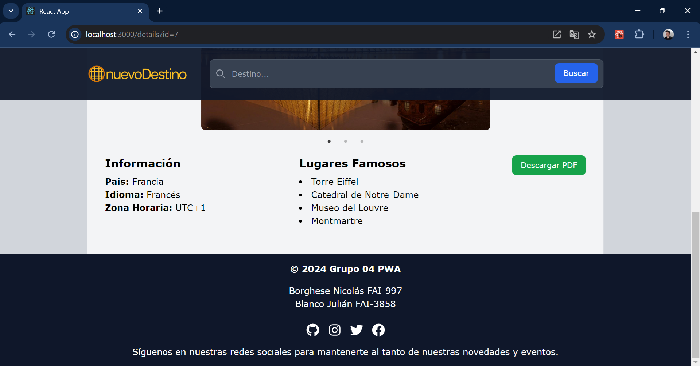

<div align="center">

Programación Web Avanzada 2024

<h3>Trabajo Práctico N°2: React</h3>
Aplicación con Múltiples Páginas
<br><br>

Logo del sitio:


<br>

</div>

---

<h3>Grupo 4</h3>

-   Borghese Nicolás FAI-997
-   Blanco Julián FAI-3858

---

<h3>Descripción de la aplicación</h3>

La aplicación es un sitio web donde se visualizan distintos destinos turísticos en forma de "cards". Al hacerles click nos dirigen hacia otra página donde podemos ver información de este destino de manera más detallada. Además se puede descargar en forma de pdf la información de cada destino. El sitio también cuenta con un buscador que nos permite hayar más facilemente los destinos a partir del nombre de ciudades o paises.

---
<h3>Imágenes de referencia del sitio</h3>


<div align="center">
  
  
  
</div>

---
<h3>Guía de instalación rápida</h3>

1. Ubicar la terminal en el directorio deseado para instalar el proyecto y clonar el repositorio ejecutando en consola el comando:
```bash
git clone https://github.com/NicolasBorghese/pwa_tp_02_multiples_paginas.git
```
2. Acceder a la carpeta donde se instalo el proyecto con el comando:

```bash
cd pwa_tp_02_multiples_paginas
```
3. Instalar las dependencias necesarias para el proyecto ejecutando el comando:

```bash
npm install
```

4. Ejecutar la aplicación utilizando el comando:

```bash
npm start
```

---
